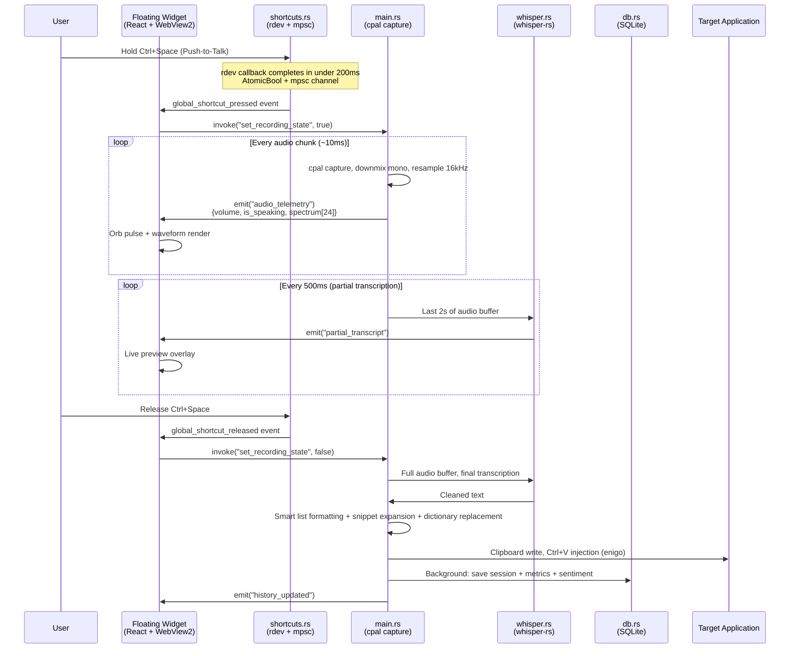
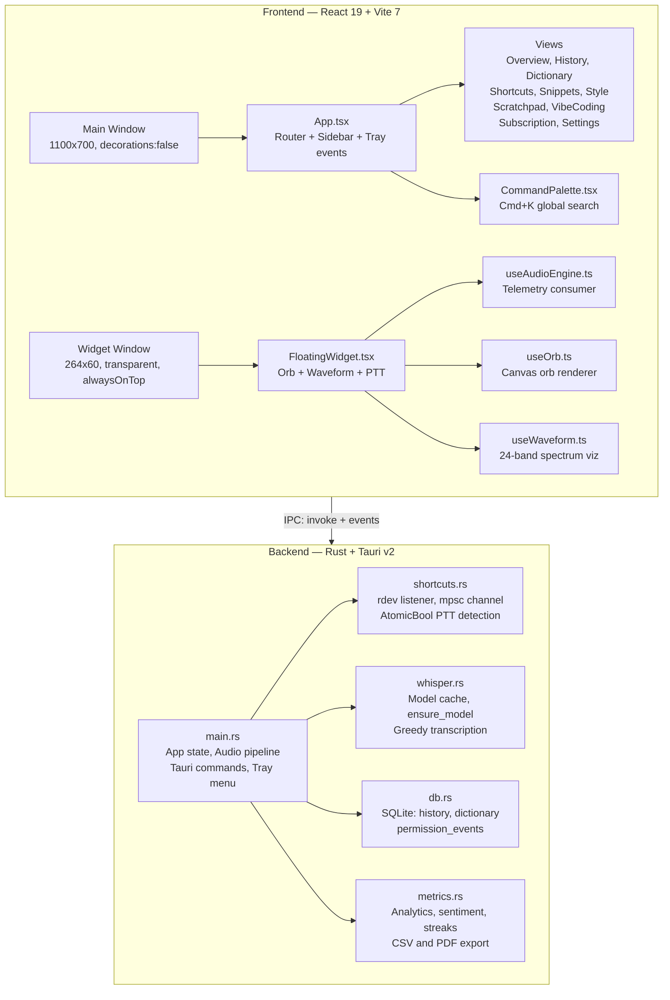

<div align="center">

# SIULK-VOICE

### Enterprise Voice-to-Text Desktop Platform


<br/>

**SIULK-VOICE** is a premium, enterprise-grade desktop application that converts speech to text in real time using a fully **on-device** inference pipeline. Built on **Tauri v2** (Rust backend) and **React 19** (TypeScript frontend), it delivers ultra-low-latency transcription without ever sending audio data to external servers.

The application features a **floating desktop widget** with an animated orb and live waveform visualizer, a **push-to-talk** global shortcut system, automatic text injection into any focused application via clipboard strategy, and a comprehensive analytics dashboard with sentiment analysis, productivity streaks, and session telemetry.

SIULK-VOICE is designed for professionals who demand speed, privacy, and a luxury-tier user experience — from solo developers dictating code to enterprise teams requiring auditable, on-premise voice workflows.

</div>

---

## Table of Contents

1. [System Architecture](#1-system-architecture)
2. [Core Features](#2-core-features)
3. [Getting Started](#3-getting-started)
4. [Environment Variables](#4-environment-variables)
5. [Project Structure](#5-project-structure)
6. [NPM & Cargo Scripts](#6-npm--cargo-scripts)
7. [Build & Deploy](#7-build--deploy)
8. [Testing](#8-testing)
9. [CI/CD Pipeline](#9-cicd-pipeline)
10. [Contributing](#10-contributing)

---

## 1. System Architecture

### Transcription Lifecycle (Ultra-Low Latency)



### Component Architecture



---

## 2. Core Features

### Voice Engine
- **Ultra-fast local transcription** — Whisper.cpp (`ggml-base.en.bin`, ~141 MB) running natively via `whisper-rs`, multi-threaded (up to 8 cores)
- **Continuous partial transcription** — Live preview every 500ms using a sliding 2-second audio window
- **Smart auto-formatting** — Ordinal detection (English/Spanish) auto-converted to numbered lists (`first` → `1.`)
- **Audio resampling pipeline** — Any input sample rate → 16 kHz mono with linear interpolation
- **Model warm-up at launch** — Background pre-load so the first transcription is instant

### Floating Widget
- **Always-on-top transparent pill** with animated conic-gradient border and box-shadow glow
- **Live orb** — Canvas-rendered pulsating orb responding to audio volume in real time
- **24-band waveform visualizer** — Spectral decomposition with smoothing and frequency tilt correction
- **Compact mode** (68×68 orb-only) and **normal mode** (264×60 pill with status)
- **Desktop position persistence** — Saves/restores position across sessions via `widgetPreferences.ts`
- **Draggable** — Native Tauri drag region, reset-to-safe-dock from Settings

### Push-to-Talk & Shortcuts
- **Dual shortcut system** — Tauri `global-shortcut` plugin (toggle mode) + `rdev` low-level keyboard hook (push-to-talk hold/release)
- **Windows hook safety** — `rdev` callback decoupled via `mpsc::channel` + `AtomicBool` to stay under Windows' 300ms `LowLevelHooksTimeout`
- **Configurable keys** — Default `Ctrl+Space`, remappable from the Shortcuts view
- **Injection suppression** — `INJECTION_ACTIVE` atomic flag prevents rdev from capturing synthetic `Ctrl+V` keystrokes

### Text Injection
- **Enterprise clipboard strategy** — Save clipboard → write transcription → `Ctrl+V` via enigo → restore clipboard
- **Works in any application** — VS Code, Cursor, Windsurf, browsers, Word, Slack, etc.
- **Foreground app detection** — `GetForegroundWindow` (Win32 API) for context-aware behavior

### Vibe Coding
- **Developer-focused voice mode** with IDE detection (VS Code, Cursor, Windsurf)
- **Variable recognition** — Contextual understanding of code identifiers
- **Command Mode** — Voice-triggered IDE actions

### Analytics & Intelligence
- **Executive dashboard** — Total words, WPM, time saved, streaks, projections
- **Sentiment analysis** — Per-session VADER sentiment scoring (positive/neutral/negative + compound)
- **Hourly heatmap** — 24-hour activity distribution
- **Yearly contribution graph** — GitHub-style 365-day activity grid
- **Productivity trends** — 14-day rolling charts (words, sessions, time saved)
- **Word cloud** — Top 30 keywords with frequency percentages
- **Export** — CSV (history + analytics) and PDF report generation

### Dictionary & Snippets
- **Dictionary context engine** — Automatic word replacement post-transcription (e.g., brand names, technical terms)
- **Voice snippets** — Trigger phrases expanded during transcription (e.g., say "email signature" → full block)
- **Synced to backend** — `sync_snippets` command keeps frontend and Rust states aligned

### Premium UX
- **Glassmorphism shell** — Sidebar, header, and panels with backdrop-filter blur and premium gradients
- **Framer Motion** throughout — Page transitions, nav pill `layoutId`, hover/tap microinteractions
- **Command Palette** — `⌘K` global search across all views and actions
- **Theme system** — `void` (dark) and `light` modes with full CSS variable overrides
- **System tray** — Full menu with recording toggle, mute, navigation, widget controls, theme switch
- **Single instance** — `tauri-plugin-single-instance` prevents duplicate processes
- **Permission alert system** — Microphone errors classified, persisted to DB, surfaced as toasts with audio tones

---

## 3. Getting Started

### Prerequisites

| Tool | Minimum Version | Purpose |
|------|----------------|---------|
| **Node.js** | 18 LTS+ | Frontend build toolchain |
| **npm** | 9+ | Package manager |
| **Rust** | 1.77.2+ | Backend compilation |
| **Cargo** | (bundled with Rust) | Rust package manager |
| **Tauri CLI** | 2.x | Desktop app build/dev |

#### Platform-specific

| Platform | Additional Requirements |
|----------|----------------------|
| **Windows** | WebView2 (pre-installed on Win 10/11), Visual Studio Build Tools (C++ workload) |
| **macOS** | Xcode Command Line Tools (`xcode-select --install`) |
| **Linux** | `libwebkit2gtk-4.1-dev libappindicator3-dev librsvg2-dev patchelf libxdo-dev libasound2-dev` |

### Step-by-step Setup

#### 1. Clone the repository

```bash
git clone https://github.com/nordlar49-design/SIULK-VOICE.git
cd SIULK-VOICE
```

#### 2. Install frontend dependencies

```bash
npm install
```

#### 3. Download the Whisper model

The application auto-downloads `ggml-base.en.bin` (~141 MB) on first launch. For offline/faster setup, manually place it:

```bash
# Option A: Place in src-tauri/ (development mode)
curl -L https://huggingface.co/ggerganov/whisper.cpp/resolve/main/ggml-base.en.bin \
     -o src-tauri/ggml-base.en.bin

# Option B: Place in the app data directory
# Windows: %APPDATA%/com.siulk.voice/ggml-base.en.bin
# macOS:   ~/Library/Application Support/com.siulk.voice/ggml-base.en.bin
# Linux:   ~/.local/share/com.siulk.voice/ggml-base.en.bin
```

#### 4. Launch in development mode

```bash
npm run tauri:dev
```

This concurrently starts:
- **Vite dev server** on `http://localhost:5173` (hot reload)
- **Tauri Rust backend** (compiled in debug mode)

> First launch compiles all Rust crates (~3-5 min). Subsequent launches are incremental (~5-15s).

---

## 4. Environment Variables

SIULK-VOICE is a **fully local, offline application**. It does not require external API keys or cloud services for its core functionality. All inference runs on-device.

| Variable | File | Description |
|----------|------|-------------|
| `GITHUB_TOKEN` | CI only (`.github/workflows/`) | GitHub Actions token for automated release publishing. Injected as a secret — never committed. |
| `TAURI_SIGNING_PRIVATE_KEY` | CI only | Optional. Private key for signing Tauri update bundles in production builds. |
| `TAURI_SIGNING_PRIVATE_KEY_PASSWORD` | CI only | Optional. Password for the signing key above. |

> **Note:** No `.env` file is required for local development. The SQLite database is auto-created at `{APP_DATA_DIR}/siulk-voice.sqlite` on first run.

---

## 5. Project Structure

```
SIULK-VOICE/
├── .github/
│   └── workflows/
│       └── release.yml              # CI/CD: lint, test, build (Win/Mac/Linux)
│
├── public/
│   ├── logo.png                     # App logo (sidebar, titlebar)
│   ├── logo-square.png              # Square variant
│   └── vite.svg                     # Vite default asset
│
├── src/                             # ── FRONTEND (React 19 + TypeScript) ──
│   ├── components/
│   │   ├── CommandPalette.tsx        # Cmd+K global search overlay
│   │   ├── ErrorBoundary.tsx         # React error boundary
│   │   ├── FloatingWidget.tsx        # Floating desktop widget (orb + waveform + PTT)
│   │   ├── Toast.tsx                 # Toast notification system
│   │   └── Widget.tsx                # Widget shell component
│   │
│   ├── hooks/
│   │   ├── useAudioEngine.ts         # Audio telemetry consumer (volume, spectrum, state)
│   │   ├── useOrb.ts                 # Canvas orb renderer (pulse, glow, idle/recording)
│   │   ├── usePermissionAlerts.ts    # Microphone permission toast alerts
│   │   └── useWaveform.ts            # 24-band spectrum waveform visualizer
│   │
│   ├── lib/
│   │   ├── desktopMedia.ts           # Desktop media utilities
│   │   ├── toastBus.ts               # Shared toast event bus (non-component)
│   │   └── widgetPreferences.ts      # Widget position/theme/opacity persistence
│   │
│   ├── views/
│   │   ├── OverviewDashboard.tsx      # Executive analytics dashboard
│   │   ├── History.tsx                # Transcript timeline vault
│   │   ├── Dictionary.tsx             # Context rule / replacement engine
│   │   ├── Shortcuts.tsx              # Global hotkey configuration
│   │   ├── Snippets.tsx               # Voice snippet expansion manager
│   │   ├── Style.tsx                  # Dictation formatting preferences
│   │   ├── Scratchpad.tsx             # Quick notes and drafts
│   │   ├── VibeCoding.tsx             # Developer voice tools (IDE integration)
│   │   ├── Subscription.tsx           # Enterprise plan / subscription surface
│   │   ├── Settings.tsx               # System configuration (theme, device, widget)
│   │   └── Overview.tsx               # Legacy overview (superseded by Dashboard)
│   │
│   ├── tests/
│   │   ├── buttonValidation.test.tsx  # Widget accessibility and button audit tests
│   │   └── widget.test.tsx            # Widget unit tests
│   │
│   ├── audit/
│   │   └── button-audit.json          # Button inventory (desktop, widget, tray, landing)
│   │
│   ├── App.tsx                        # Root component (router, sidebar, tray, theme)
│   ├── App.css                        # App-level styles
│   ├── index.css                      # Design system (CSS variables, themes, utilities)
│   ├── main.tsx                       # Main window entry point
│   └── widget-entry.tsx               # Widget window entry point
│
├── src-tauri/                         # ── BACKEND (Rust + Tauri v2) ──
│   ├── src/
│   │   ├── main.rs                    # App entry, state, audio pipeline, tray, commands
│   │   ├── shortcuts.rs               # Global keyboard hook (rdev + mpsc + AtomicBool)
│   │   ├── whisper.rs                 # Whisper model management and transcription
│   │   ├── db.rs                      # SQLite schema, migrations, CRUD operations
│   │   ├── metrics.rs                 # Analytics engine, sentiment, streaks, exports
│   │   ├── analytics.rs               # Legacy analytics module
│   │   ├── lib.rs                     # Tauri mobile entry point
│   │   └── sync_tests.rs              # Backend synchronization tests
│   │
│   ├── capabilities/
│   │   └── default.json               # Tauri v2 capability permissions (main + widget)
│   │
│   ├── icons/                         # App icons (all platforms: Win, Mac, Linux, iOS, Android)
│   ├── Cargo.toml                     # Rust dependencies
│   ├── Cargo.lock                     # Locked dependency versions
│   ├── tauri.conf.json                # Tauri config (windows, bundle, build commands)
│   └── build.rs                       # Tauri build script
│
├── scripts/
│   ├── collect-windows-release.mjs    # Collects .exe/.msi into release/windows/
│   └── generate-button-audit-report.mjs  # Generates HTML button audit report
│
├── html/                              # Pre-built static audit/report assets
│   ├── button-audit-report.html
│   ├── index.html
│   └── assets/
│
├── index.html                         # Main window HTML entry
├── widget.html                        # Widget window HTML entry
├── vite.config.ts                     # Vite config (multi-entry: main + widget)
├── tailwind.config.js                 # Tailwind CSS configuration
├── tsconfig.json                      # TypeScript project references
├── tsconfig.app.json                  # App TypeScript config
├── tsconfig.node.json                 # Node scripts TypeScript config
├── eslint.config.js                   # ESLint flat config
├── postcss.config.js                  # PostCSS (Tailwind + Autoprefixer)
├── package.json                       # NPM scripts and dependencies
├── stress-test-widget.spec.ts         # Playwright widget stress test
└── README.md                          # This file
```

---

## 6. NPM & Cargo Scripts

### Frontend / Orchestration (npm)

| Command | Description |
|---------|-------------|
| `npm run dev` | Start Vite dev server only (no Rust backend) |
| `npm run build` | TypeScript check + Vite production build → `dist/` |
| `npm run tauri:dev` | **Full dev mode**: Vite + Tauri Rust backend (hot reload) |
| `npm run tauri:build` | Production build of Tauri app (frontend + Rust release binary) |
| `npm run bundle:windows` | Build + collect Windows release artifacts to `release/windows/` |
| `npm run lint` | Run ESLint across the entire frontend codebase |
| `npm run test` | Run Vitest unit tests (jsdom environment) |
| `npm run test:unit` | Alias for `npm run test` |
| `npm run test:widget:stress` | Run Playwright widget stress test |
| `npm run audit:buttons:report` | Generate HTML button audit report from inventory |
| `npm run preview` | Preview production build via Vite |

### Backend (Cargo — run from `src-tauri/`)

| Command | Description |
|---------|-------------|
| `cargo check` | Type-check Rust code without building |
| `cargo build` | Debug build of Rust backend |
| `cargo build --release` | Optimized release build |
| `cargo test` | Run Rust unit tests (`sync_tests` module) |
| `cargo clippy` | Lint Rust code for common mistakes |

---

## 7. Build & Deploy

### Windows Production Build

```bash
# Full pipeline: build frontend + Rust release + collect artifacts
npm run bundle:windows
```

Output artifacts in `release/windows/`:

| File | Description |
|------|-------------|
| `SIULK-VOICE-portable.exe` | Standalone portable executable (no installer needed) |
| `SIULK-VOICE-setup.exe` | NSIS installer with install/uninstall flow |
| `SIULK-VOICE.msi` | Windows Installer package (enterprise/GPO deployment) |

### macOS Production Build

```bash
npm run tauri:build -- --target aarch64-apple-darwin   # Apple Silicon
npm run tauri:build -- --target x86_64-apple-darwin    # Intel
```

Produces `.dmg` and `.app` in `src-tauri/target/release/bundle/`.

### Linux Production Build

```bash
# Install system dependencies first (see Prerequisites)
npm run tauri:build
```

Produces `.deb` and `.AppImage` in `src-tauri/target/release/bundle/`.

### Whisper Model Bundling

For production builds, the Whisper model (`ggml-base.en.bin`) must be available. The app resolves it in this priority order:

1. `{APP_DATA_DIR}/ggml-base.en.bin` — user's app data directory
2. `{EXE_DIR}/ggml-base.en.bin` — next to the executable (bundled)
3. `./ggml-base.en.bin` — current working directory (dev mode, from `src-tauri/`)
4. **Auto-download** from HuggingFace (last resort, requires internet)

---

## 8. Testing

```bash
# Frontend unit tests (Vitest + jsdom + React Testing Library)
npm run test

# Widget stress test (Playwright)
npm run test:widget:stress

# Rust backend tests
cd src-tauri && cargo test

# Full lint pass
npm run lint

# TypeScript type check
npx tsc --noEmit
```

---

## 9. CI/CD Pipeline

The GitHub Actions workflow (`.github/workflows/release.yml`) runs on:
- **Tag push** matching `v*` (e.g., `v0.1.0`)
- **Manual dispatch** via `workflow_dispatch`

### Pipeline Stages

```
┌─────────────────────┐     ┌──────────────────────────────────────────────┐
│  test-and-lint      │     │  build-tauri (matrix)                        │
│  ─────────────────  │────>│  ──────────────────────────────────────────  │
│  npm ci             │     │  macOS ARM64   (aarch64-apple-darwin)        │
│  npm run lint       │     │  macOS Intel   (x86_64-apple-darwin)         │
│  npx tsc --noEmit   │     │  Linux x64     (ubuntu-22.04)               │
│  npx vitest run     │     │  Windows x64   (windows-latest)             │
└─────────────────────┘     │                                              │
                            │  tauri-action -> GitHub Release (draft)       │
                            └──────────────────────────────────────────────┘
```

---

## 10. Contributing

### Recommended IDE Setup

- **VS Code** / **Cursor** / **Windsurf** with:
  - [Tauri Extension](https://marketplace.visualstudio.com/items?itemName=tauri-apps.tauri-vscode)
  - [rust-analyzer](https://marketplace.visualstudio.com/items?itemName=rust-lang.rust-analyzer)
  - [ESLint](https://marketplace.visualstudio.com/items?itemName=dbaeumer.vscode-eslint)
  - [Tailwind CSS IntelliSense](https://marketplace.visualstudio.com/items?itemName=bradlc.vscode-tailwindcss)

### Key Rust Dependencies

| Crate | Purpose |
|-------|---------|
| `tauri 2.10` | Desktop app framework (IPC, windows, tray, plugins) |
| `whisper-rs 0.11` | Whisper.cpp Rust bindings (local speech-to-text) |
| `cpal 0.17` | Cross-platform audio capture |
| `rdev 0.5` | Global keyboard/mouse event listener |
| `enigo 0.2` | Simulated keyboard input (Ctrl+V injection) |
| `rusqlite 0.31` | SQLite database (bundled) |
| `vader_sentiment 0.1` | Sentiment analysis (VADER lexicon) |
| `tokio 1.50` | Async runtime |
| `chrono 0.4` | Date/time for analytics and streaks |

### Key Frontend Dependencies

| Package | Purpose |
|---------|---------|
| `react 19` / `react-dom 19` | UI framework |
| `framer-motion 12` | Animations and microinteractions |
| `lucide-react` | Premium icon library |
| `recharts 3` | Analytics charts (area, bar, radar) |
| `tailwind-merge` | Conditional Tailwind class merging |
| `clsx` | Classname utility |

---

<div align="center">

**Built with precision by the SIULK team.**

*On-device. Ultra-fast. Enterprise-grade.*

</div>
